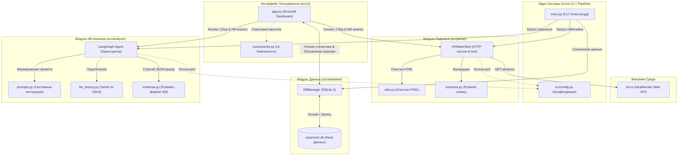

# 🕵️‍♂️ QA Job AI Analyzer

Персональный интеллектуальный ассистент соискателя, разработанный для автоматизации поиска, детального парсинга и ИИ-скрининга вакансий на платформе **hh.ru**. 

Система ориентирована на **QA Automation / Fullstack QA** инженеров (особенно с Python/Playwright стеком) и оптимизирована под оценку перспектив удаленной работы и оформления по контракту **B2B / ИП**.

---

## 🏗 Архитектура проекта и Взаимодействие Модулей

Приложение спроектировано по модульному принципу, разделяя зоны ответственности между сетевым клиентом, реляционным хранилищем, ИИ-агентом и веб-интерфейсом.



---

## 📦 Описание Модулей и Компонентов

### 1. Точка входа и Пайплайны (`main.py`)
CLI-скрипт, реализующий последовательный запуск трех фаз обработки:
* **Фаза 1 (Сбор):** Через `HHWebClient` запрашивает первую страницу результатов поиска по строгому и сложному поисковому запросу. Сохраняет базовые метаданные (ID, название, компания, URL) в SQLite со статусом `NEW`.
* **Фаза 2 (Парсинг):** Находит в БД вакансии в статусе `NEW`, скачивает их полные веб-страницы, извлекает текст описания и теги навыков, обновляя статус записи на `PARSED` (или `FAILED` в случае ошибок).
* **Фаза 3 (ИИ-скрининг):** Считывает резюме соискателя (`my_profile.txt`), загружает вакансии со статусом `PARSED` или `FAILED` и отправляет их в ИИ-агент. Полученный структурированный вердикт сохраняется в БД в формате JSON, а статус вакансии переводится в `ANALYZED`.

### 2. Модуль Парсинга (`src/parser/`)
Отвечает за бесшовную интеграцию с веб-версией HeadHunter в обход ограничений:
* **`client.py` (`HHWebClient`):** Реализует HTTP-сессию с заголовками реального браузера (User-Agent, куки, CSRF-токены и специальные внутренние заголовки HH).
  * `fetch_vacancies_page`: Осуществляет поиск по сложному логическому выражению (исключает Junior-позиции, непрофильные языки, ручное тестирование без автоматизации).
  * `fetch_vacancy_details`: Скачивает веб-страницу вакансии, точечно вытаскивая блок `data-qa="vacancy-description"` и теги ключевых навыков.
* **`schemas.py`:** Задает строгие модели данных Pydantic v2 (`VacancyListItem`, `HHWebSearchResponse`, `VacancyDetails`) для защиты приложения от возможных изменений в API hh.ru.
* **`utils.py` (`clean_html`):** Очищает сырой HTML-текст вакансий от тегов разметки, декодирует спецсимволы и убирает лишние пробелы.

### 3. Модуль Хранения (`src/database/`)
* **`manager.py` (`DBManager`):** Управляет реляционным хранилищем SQLite (`vacancies.db`).
  * Обеспечивает автоинициализацию и автоматическое проведение миграций (например, добавление колонки `user_status`).
  * Предоставляет потокобезопасные методы транзакций для записи сырых вакансий, добавления HTML-описаний, сохранения вердиктов ИИ и изменения статусов пользовательской воронки (`CONSIDERING`, `APPLIED`, `REJECTED`).

### 4. Аналитический Модуль (`src/analyzer/`)
* **`llm_factory.py`:** Создает настроенный клиент `ChatVertexAI` для модели `gemini-3.5-flash` через официальный SDK Google Cloud GCP.
* **`schemas.py` (`VacancyMatchingResult`):** Описывает Pydantic-схему строгого типизированного ответа от ИИ (оценка соответствия `score` от 1 до 5, вероятность контракта по ИП, обоснование оценки, списки плюсов, минусов и критических несоответствий/Red Flags, краткое резюме).
* **`prompts.py`:** Содержит промпт-инструкции для ИИ в роли опытного технического QA-лида и IT-рекрутера, регламентирующие жесткие критерии оценки соискателя и проверку формата контракта.
* **`agent.py` (`run_vacancy_analysis`):** Обертка на базе **LangGraph** с линейным графом состояний для выполнения ИИ-скрининга с гарантированным возвратом валидного JSON (через механизм `.with_structured_output`).

### 5. Веб-Интерфейс (`src/ui/`)
Разработан на фреймворке **Streamlit** для интерактивного взаимодействия с базой данных и оркестрации процессов:
* **`app.py`:**
  * **Боковая панель:** Показывает агрегированную статистику базы данных и воронки соискателя (в реальном времени). Предоставляет кнопки запуска процессов: "Собрать вакансии за 24ч" и "Запустить ИИ-скрининг" с отображением прогресс-бара и логов.
  * **Вкладка "Новые Топ Матчи":** Интерактивная витрина вакансий со скором `>= 4`, которые соискатель еще не обработал.
  * **Вкладка "Полный Архив":** Таблица со всеми проанализированными вакансиями, их оценками, статусами и датами.
  * **Вкладка "Твое Резюме":** Удобный просмотр текущей версии файла `my_profile.txt`.
* **`components.py` (`render_vacancy_card`):** Форматирует вывод карточки вакансии. Раскрывает оценку ИИ, шансы на ИП, резюме, плюсы/минусы, "Red Flags" (выделяются ярким предупреждением), а также содержит интерактивные кнопки "🚀 Откликнулся" и "❌ Не подходит" для быстрого перемещения вакансий по воронке.

---

## 🛠 Дополнительные файлы
* **`test_ai.py`:** Инструмент быстрой самодиагностики. Выполняет тестовый пинг-запрос к Vertex AI Gemini для верификации сетевой доступности и авторизационных ключей GCP.
* **`my_profile.txt`:** Файл профиля соискателя, содержащий стек технологий, опыт, достижения и индивидуальные пожелания к поиску работы.
* **`requirements.txt`:** Список Python-зависимостей проекта (включая `streamlit`, `langchain-google-vertexai`, `langgraph`, `beautifulsoup4`, `requests` и `pydantic`).

---

## 🔄 Жизненный цикл Вакансии (Статусы)

```
[Поиск] ──> 'NEW' (Только ID) ──> [Парсинг] ──> 'PARSED' (HTML & навыки) ──> [Gemini AI] ──> 'ANALYZED' (Оценки в БД)
                                                    │                                            │
                                                    └─── (При ошибке сети) ──> 'FAILED' ─────────┘
```
